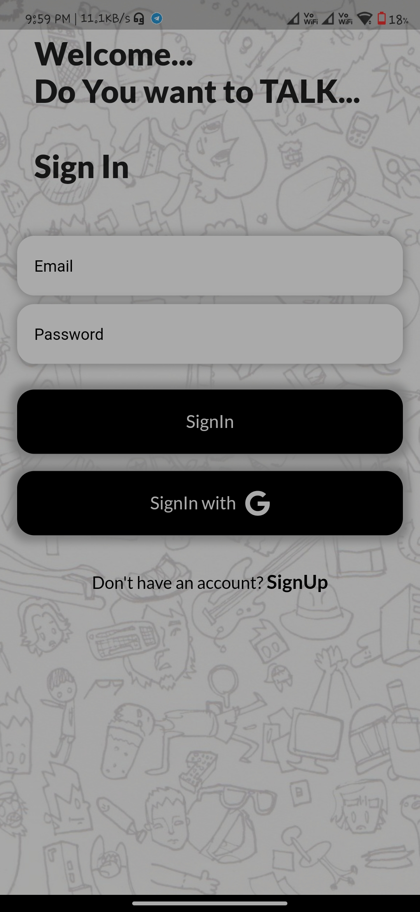
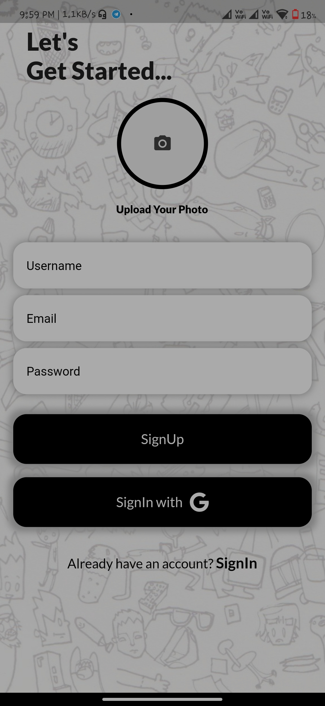
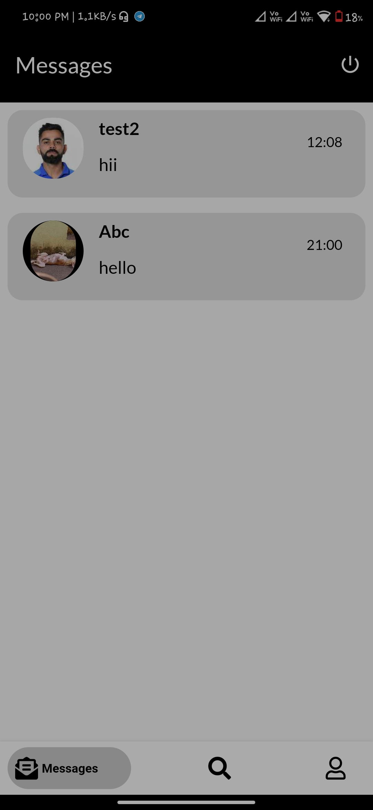
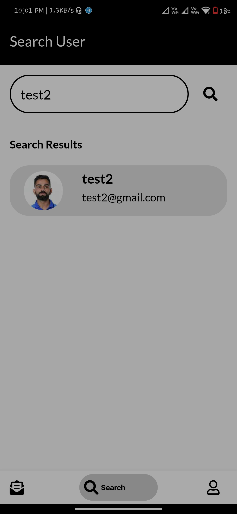
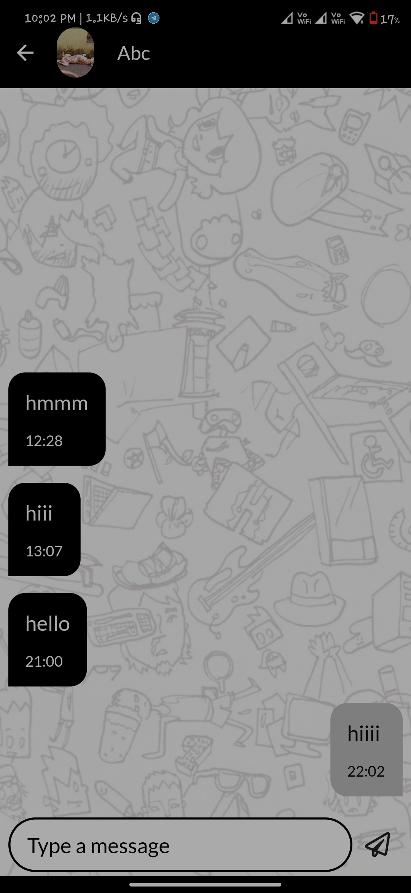
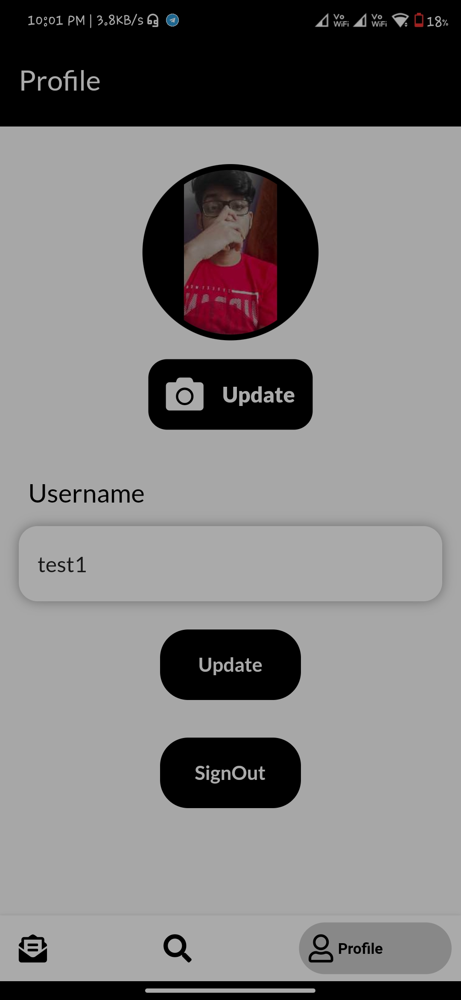

# Talk

Talk is a all new chat app developed completely using Flutter and backend is managed by Firebase. It provides all the basic functionality that a chat app should provide. The minimal UI is one of its main attraction.

# UI 

      
      
      
      
      
      

# Future aim